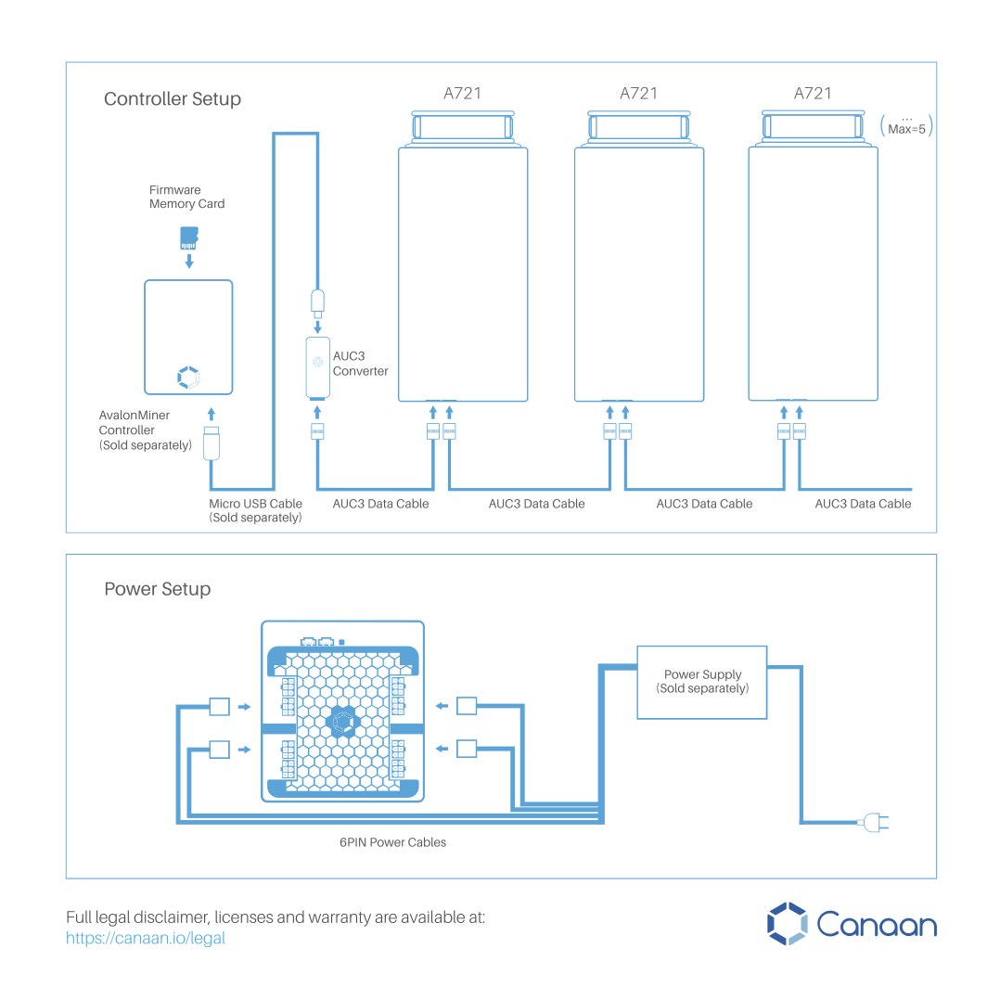
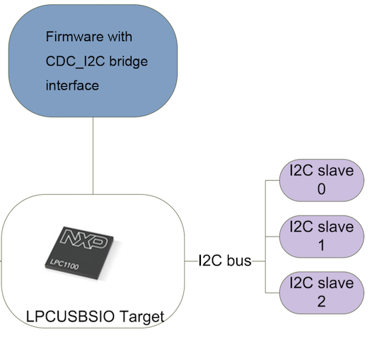
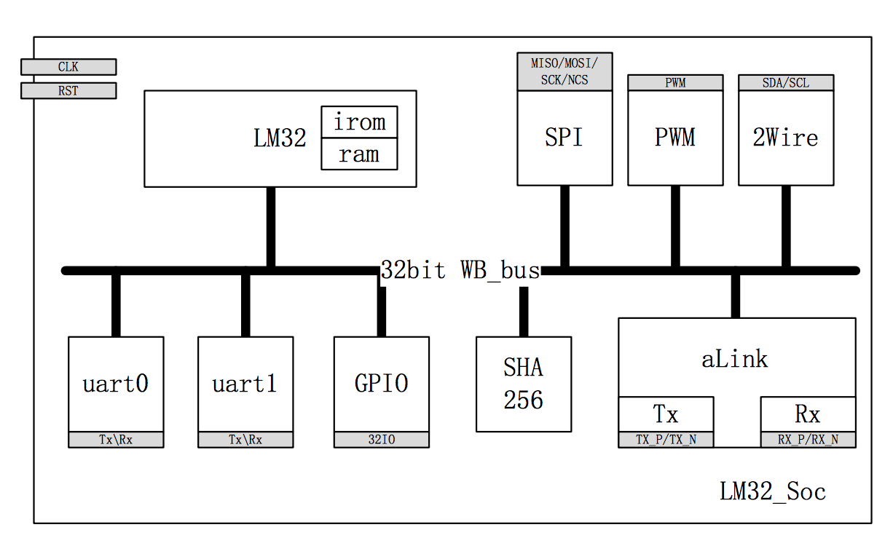
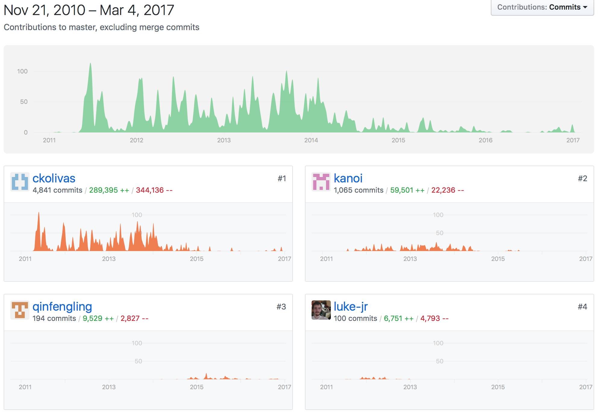
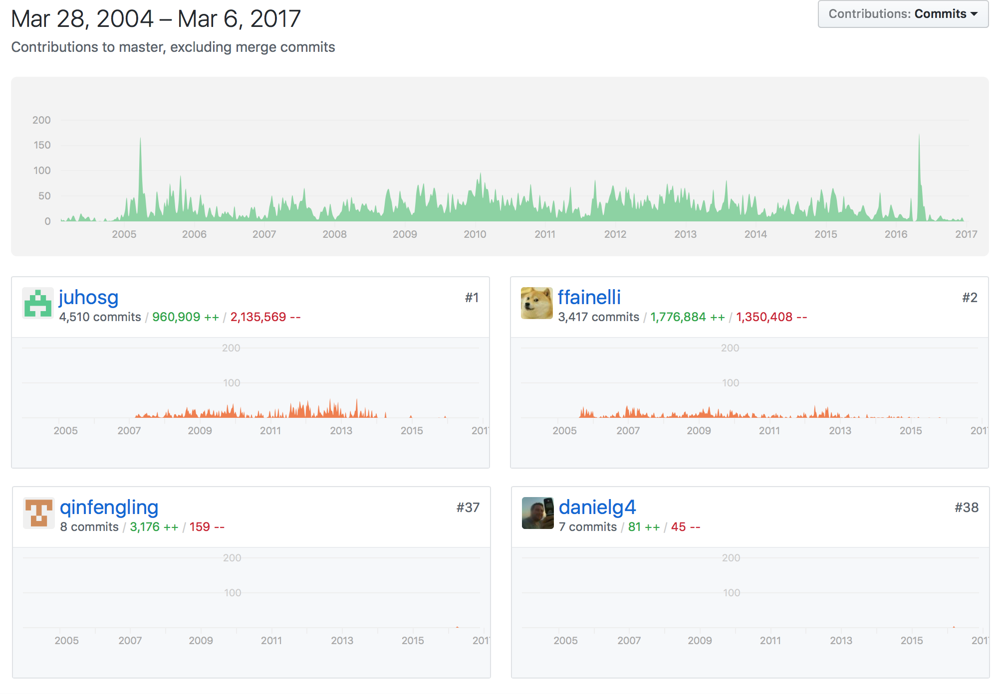

# Table of Contents
- [Introduction](#introduction)
    - [About me](#about-me)
    - [Products we made  (From Icarus to Avalon Miner)](#products-we-made-from-icarus-to-avalon-miner)
- [AvalonMiner Open Source Embedded System](#avalonminer-open-source-embedded-system)
    - [Connections](#connections)
    - [Embedded System parts](#embedded-system-parts)
    - [How to Generate firmware (AvalonMiner 721)](#how-to-generate-firmware-avalonminer-721)
    - [About Firmware verison](#about-firmware-verison)
    - [About Repo](#about-repo)
- [Contribute](#contribute)
    - [To Community](#to-community)
    - [To Canaan](#to-canaan)
- [Demo (Avalon nano v2)](#demo-avalon-nano-v2)
- [How to start ?](#how-to-start)
- [Q&A](#q&a)

Blockchain Software for Hardware: The Canaan AvalonMiner Open Source Embedded System
=================================

# Introduction

## About me
- Name: 秦风岭 Qín fēng lǐng（Fengling or Mike）
- Location: Beijing
- Interests: Linux, Open Source Projects(OSS and OSH)
- Contacts: [GitHub](https://github.com/qinfengling), [Gmail](Fengling.Qin@gmail.com)
- Experience:

		TODO: Some charts

		2008 - 2013 Digital Video Broadcast
		* Software Engineer
		* GUI (Microwindows apps)
		* Driver porting (OSD, OS, Demux, Descramble, Tuner etc)

		2013 - 2014 IoT
		* Software Engineering Manager
		* IOT gateway (JenNet-IP, OpenWrt, TL-WR703N porting)

		2014 - Now Blockchain
		* Senior Software Engineer
		* Avalon Miner (OpenWrt, CGMiner, LuCI, AUC, MM, from Avalon 3)

## Products we made  (From Icarus to Avalon Miner)
|Period     |  Product           | ASIC   | Open Source | Image
|-----------|--------------------|--------|-------------|------------------
| 2013-2014 |[Avalon 3](https://en.bitcoin.it/wiki/Avalon3)           | A3233  | Full        | **TODO: picture**
| 2014-2015 |[Avalon nano v1/v2](https://en.bitcoin.it/wiki/Avalon_nano)   | A3233  | Full        | **TODO: picture**
| 2014-2015 |[Avalon 4](https://en.bitcoin.it/wiki/Avalon4)            | A3222  | Full        | **TODO: picture**
| 2014-2015 |[Avalon 4 mini](https://en.bitcoin.it/wiki/Avalon4_mini)       | A3222  | Full        | **TODO: picture**
| 2015-2015 |Avalon 5            | A3222  | -           | **TODO: picture**
| 2015-2016 |[Avalon Miner 6](https://en.bitcoin.it/wiki/Avalon6)      | A3218  | Almost      | **TODO: picture**
| 2016-2017 |[Avalon Miner 721](https://github.com/Canaan-Creative/avalon7-docs/wiki)    | A3212  | Almost      | **TODO: picture**
Note:

1. Full means hardware design and software are all open source.
2. Almost means almost of the software are open source.

# AvalonMiner Open Source Embedded System

## Connections

## Embedded System parts
- AvalonMiner Controller:

	TODO: Software Architecture

	* OpenWrt
	* [cgminer-openwrt-packages (CGMiner + mm-tools)](https://github.com/Canaan-Creative/cgminer-openwrt-packages)
	* [LuCI](https://github.com/Canaan-Creative/luci)

- AUC (Avalon USB Converter):

	* USB2IIC
	* USB-CDC class
	* Run on LPC11u14 (from NXP)
	* Firmware based on lpcusbsio, HID->CDC
	* Makefile based project
	* Distribute in UNLICENSE(Code from Canaan)
	* [Design files](https://canaan.io/downloads/hardware/A3218/AUC2/)

- Miner: (MM and Icarus protocol)

	* MM: (Miner Manager - Blockchain task generator)
	
		* Used in Avalon4, Avalon5, Avalon6,Avalon7xx (Fast miner like rigs)
		* Only Stratum protocol support
		* Generate task inside the FPGA (SHA-256 core)
		* Nonce and difficulty verify
		* [MM SOC Specification](https://canaan.io/downloads/people/jingjie/MM_SOC_Specification_Update_For_A3222Q56_V5.pdf)

	* Icarus miner:
		* Avalon nano v1/v2, Avalon4 mini (Slow miner like USB miner)
		* Icarus protocol
		* [Resources for Avalon nano v2](https://canaan.io/downloads/software/avalon_nano2/)

## How to Generate firmware (AvalonMiner 721)
* Step by Step
	* OpenWrt firmware: OpenWrt, LuCI, cgminer-openwrt-packages

			1. Clone OpenWrt source code
			git clone git://github.com/openwrt/openwrt.git openwrt
			cd openwrt && git checkout 851a8906
			2. Add new feeds
			src-git luci https://github.com/Canaan-Creative/luci.git;cgminer-webui-avalon7
			src-git cgminer git://github.com/Canaan-Creative/cgminer-openwrt-packages.git
			3. Choose the target and compile, that is it.

	* AUC

			1. SDK: Install LPCXpresso 6 or above (Free Edition)
			2. Clone source code
			git clone https://github.com/Canaan-Creative/Avalon-USB-converter.git Avalon-USB-converter
			3. Change to Avalon-USB-converter and compile.
			cd Avalon-USB-converter
			make -C firmware/auc
	* MM (Only for Avalon4) [How to build?](https://github.com/Canaan-Creative/MM#how-to-build)

* Automatically
	* DIY (Support Avalon4, Avalon Miner 6, Avalon Miner 721)

			wget https://raw.githubusercontent.com/Canaan-Creative/Avalon-extras/master/scripts/build-avalon-image.sh -O ./build-avalon-image.sh
			AVA_MACHINE=avalon7 AVA_TARGET_BOARD=rpi3-modelb ./build-avalon-image.sh

	* Official

		[Buildbot](http://build.canaan-creative.com:8010)
		[Daily Build](http://build.canaan-creative.com:8080/~buildbot/avalon7/openwrt/)

## About Firmware verison
- OpenWrt firmware

	1. Format

			Avalon Firmware - $DATE
			luci: $LUCI_GIT_VERSION
			cgminer: $GIT_VERSION
			cgminer-packages: $OW_GIT_VERSION
	2. How to find it?

			/etc/avalon_version
- AUC firmware

	1. Format

			AUC-$DATE
	2. How to find it?

			https://github.com/Canaan-Creative/Avalon-extras/blob/master/scripts/avalon7/avalon7-core-test.py#L301
- MM firmware

	1. Format

			7211612-$(GIT_VERSION)$(GIT_STATUS)
	3. How to find it?

			https://github.com/Canaan-Creative/Avalon-extras/blob/master/scripts/avalon7/avalon7-core-test.py#L293

## About Repo
* Fast miner

| Name     |  AUC   | OpenWrt   | MM          | mm-tools | CGMiner | LuCI | cgminer-openwrt-packages
|-----------|--------|-----------|-------------|-------------|-------------|-------------|-------------
|Avalon 4   |[master](https://github.com/Canaan-Creative/Avalon-USB-converter/tree/master)|[trunk@43076](https://dev.openwrt.org/browser/trunk?rev=43076)|[avalon4](https://github.com/Canaan-Creative/MM/tree/avalon4)|[master](https://github.com/Canaan-Creative/Avalon-extras/tree/master/mm-tools)|[avalon4](https://github.com/Canaan-Creative/cgminer/tree/avalon4)|[cgminer-webui-avalon4](https://github.com/Canaan-Creative/luci/tree/cgminer-webui-avalon4)|[master](https://github.com/Canaan-Creative/cgminer-openwrt-packages)
|Avalon 5   |[master](https://github.com/Canaan-Creative/Avalon-USB-converter/tree/master)|[trunk@43076](https://dev.openwrt.org/browser/trunk?rev=43076)|[a5dev](https://github.com/Canaan-Creative/MM/tree/a5dev)|[master](https://github.com/Canaan-Creative/Avalon-extras/tree/master/mm-tools)|[avalon4](https://github.com/Canaan-Creative/cgminer/tree/avalon4)|[cgminer-webui-avalon4](https://github.com/Canaan-Creative/luci/tree/cgminer-webui-avalon4)|[master](https://github.com/Canaan-Creative/cgminer-openwrt-packages)
|Avalon Miner 6|[master](https://github.com/Canaan-Creative/Avalon-USB-converter/tree/master)|[cac971da](http://git.openwrt.org/?p=openwrt.git;a=commit;h=cac971da)||[master](https://github.com/Canaan-Creative/Avalon-extras/tree/master/mm-tools)|[avalon4](https://github.com/Canaan-Creative/cgminer/tree/avalon4)|[cgminer-webui-avalon6](https://github.com/Canaan-Creative/luci/tree/cgminer-webui-avalon6)|[master](https://github.com/Canaan-Creative/cgminer-openwrt-packages)
|Avalon Miner 721 |[master](https://github.com/Canaan-Creative/Avalon-USB-converter/tree/master)|[851a8906](https://github.com/openwrt/openwrt/commits/851a8906)||[master](https://github.com/Canaan-Creative/Avalon-extras/tree/master/mm-tools)|[master](https://github.com/Canaan-Creative/cgminer/tree/master)|[cgminer-webui-avalon7](https://github.com/Canaan-Creative/luci/tree/cgminer-webui-avalon7)|[master](https://github.com/Canaan-Creative/cgminer-openwrt-packages)

* Slow miner

| Name          | CGMiner    | App
|---------------|------------|-----------
|Avalon nano v1 |[avalon-usb](https://github.com/Canaan-Creative/cgminer/tree/avalon-usb)| [Windows App](https://canaan.io/downloads/software/avalon_nano/software/latest/)
|Avalon nano v2 |[avalon4](https://github.com/Canaan-Creative/cgminer/tree/avalon4)| [Chrome App](https://canaan.io/downloads/software/avalon4_mini/app/Avalon_miner_latest.crx)
|Avalon4 mini   |[avalon4](https://github.com/Canaan-Creative/cgminer/tree/avalon4)| [Chrome App](https://canaan.io/downloads/software/avalon4_mini/app/Avalon_miner_latest.crx)

# Contribute

## To community
- Code
	* CGMiner

	
	driver-icarus.c
	driver-avalon-miner.c
	driver-avalon4.c
	driver-avalon7.c

	* OpenWrt

	

- Document
	* [Bitcoin Wiki](https://en.bitcoin.it/wiki/Avalon)
	* [OpenWrt Wiki](https://wiki.openwrt.org/start)

- Hardware support
	* Rasberry Pi 1, 2, 3
	* Zedboard
	* Orange Pi 2
	* TL-WR703N
	* TL-MR3020
	* Linksys WRT1200AC

## To Canaan
- Fork and PR through [GitHub](https://github.com/canaan-createive)
- Code style: Linux kernel
- Never commit useless code
- Your feedback or new issues are welcome

# Demo (Avalon nano v2)
- Mining with CGMiner

- Mining with Chrome App

# How to start ?
- Wiki: http://en.bitcoin.it/wiki
- Forum: http://bitcointalk.org
- Book: Mastering Bitcoin.pdf

# Q&A

 Content licensed under a Creative Commons Attribution-ShareAlike 4.0 International License
